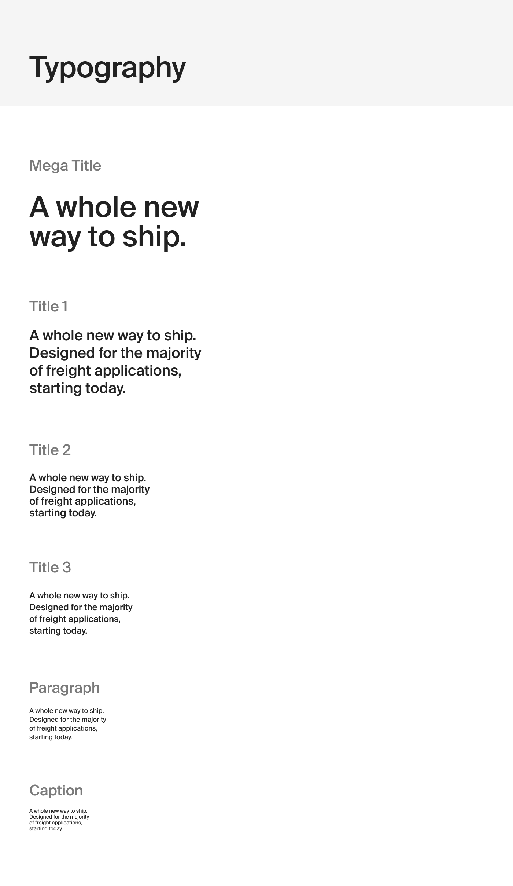
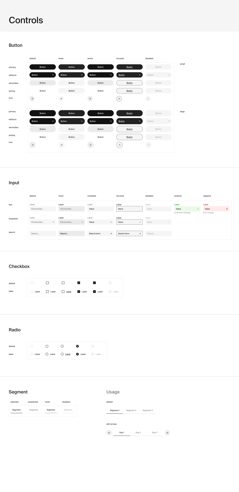

# @einride/ui

This package provides reusable React components that adhere to Einride's design system.

## Installation

Install this component system with NPM or Yarn:

```bash
# npm
npm install @einride/ui

# yarn
yarn add @einride/ui
```

## Usage

All currently available components are documented in our [Storybook](https://master--606dcc0a2208ee00215fb2d9.chromatic.com/).

Here's a couple of examples of the visual look and feel:




## License

@einride/ui is licensed under the [MIT License](LICENSE).
